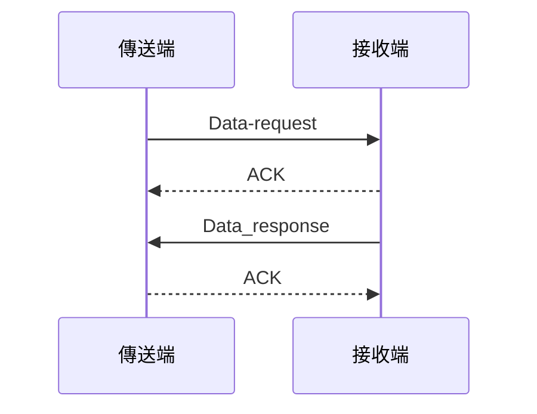
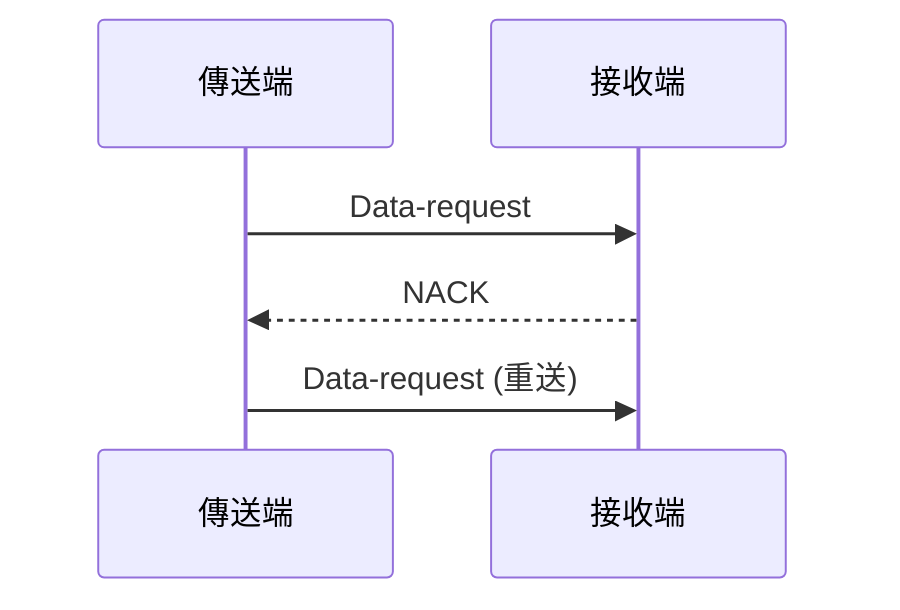
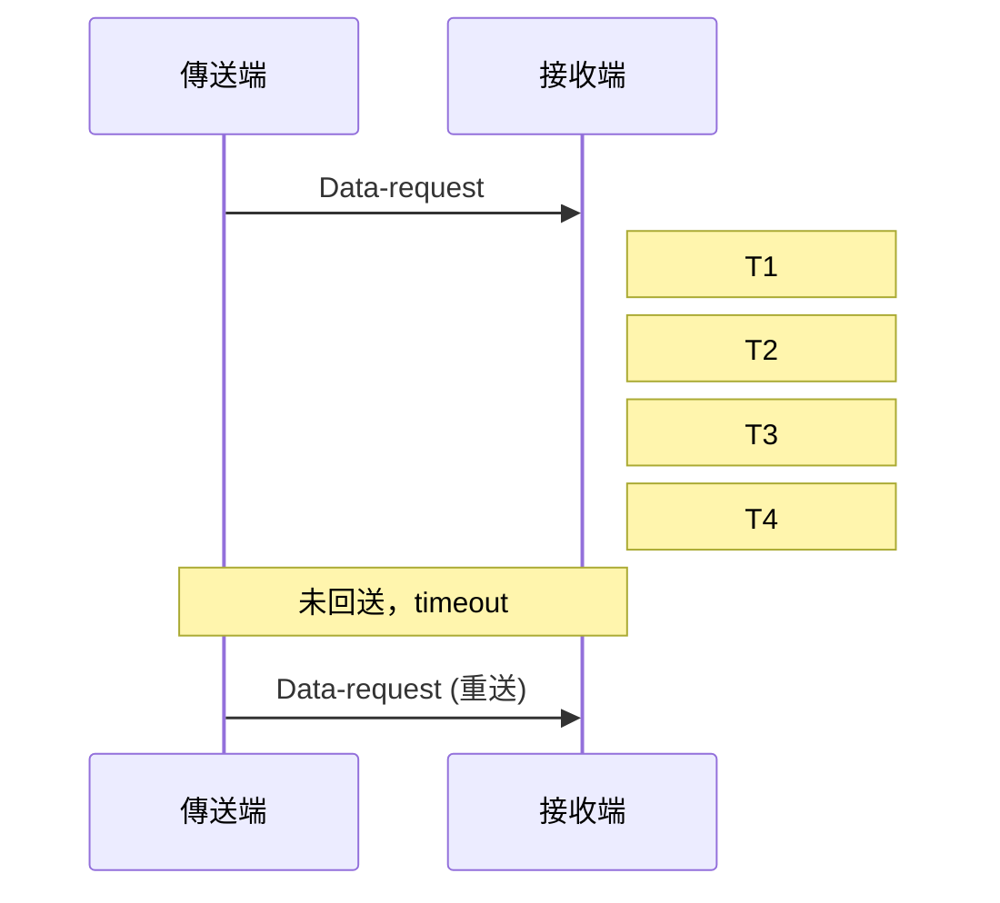

# 都市交通控制通訊協定 3.0 版
交通部  
中華民國九十三年十一月

#### 版本編碼方式
- 採用 M.N 格式
  - M：主要版次（改版幅度較大時使用）
  - N：次要版次（標示小幅調整）
- 修訂期間版本編碼：M.N r a
  - r：標示修訂中
  - a：修訂中通訊協定之序號

### 五、工作範圍與說明

#### 主要通訊協定範圍
1. 通訊底層碼框
2. 號誌控制器(IC)
3. 車輛偵測器(VD)
4. 資訊可變標誌(CMS)

#### 通訊協定等級分類
- B (Basic)：基本交通控制功能
- A (Advance)：進階交通控制功能
- O (Option)：選擇性交通控制功能

### 六、設計理念

主要改進項目：
1. 系統架構設計理念更新
2. 複合碼設計優化
3. 時相步階調整彈性化
4. 觸動控制改進
5. 資訊可變標誌現代化
6. 調撥車道功能擴充
7. 車輛偵測器功能增強
8. 無線通訊支援
9. 時制時段型態彈性化
10. 訊息偵測機制
11. 代傳訊息功能
12. 燈態排列優化

### 七、使用注意說明

#### 通訊協定分類
1. B (Basic)：基本交通控制訊息
2. A (Advance)：進階交通控制訊息
3. O (Option)：選擇性交通控制訊息

#### 設備規格要求
- 號誌控制器：至少需具備基本訊息及進階訊息
- 車輛偵測器：至少需具備基本訊息
- 資訊可變標誌：至少需具備基本訊息

#### 硬體規格注意事項
1. 選擇性交通控制訊息由主辦機關視需要納入
2. 岔路數及綠燈分相數最高限為8
3. 步階設定時相相關代碼
4. 無線通訊環境下的燈號顯示設定
5. 硬體狀態需求明訂

## 肆、現場設備共用訊息

### 訊息分類表

| 序號 | 訊息類別 | 訊息型態 | 訊息編號 | 87年協定 | 訊息等級 | 頁次 | 勾選 |
|------|----------|----------|----------------------|------------------------|----------|------|------|
| 1 | 訊息回應處理 | 設定回報 | 0F H+80 H | 00 H | B | P4-4 | ☆ |
| 2 |  | 設定回報 查詢回報 | 0F H+81 H | 01 H(更新) | B | P4-5 | ☆ |
| 3 | 訊息代傳 | 設定回報 查詢回報 | 0F H+8F H | | A | P4-7 | ☆ |
| 4 | | 設定、查詢 | 0F H+8E H | | A | P4-10 | ☆ |
| 5 | 重新啟動設備 | 設定 | 0F H+10 H | 10 H | B | P4-13 | ☆ |
| 6 |  | 設定回報 | 0F H+90 H | 15 H | B | P4-15 | ☆ |
| 7 | 設備編號管理 | 查詢 | 0F H+40 H | 18 H | O | P4-16 | O |
| 8 |  | 查詢回報 | 0F H+C0 H | 29 H | O | P4-17 | O |
| 9 | 電源中斷回報 | 主動回報 | 0F H+00 H | 1E H | A | P4-18 | ☆ |
| 10 | 設定 | 設定 | 0F H+11 H | 11 H | B | P4-19 | ☆ |
| 11 | 設備通訊重新啟動與檢測管理 | 設定回報 | 0F H+91 H | 19 H | B | P4-20 | ☆ |
| 12 | 設備通訊重新啟動與檢測管理 | 查詢 | 0F H+41 H | 1C H(更新) | B | P4-21 | ☆ |
| 13 | 設備通訊重新啟動與檢測管理 | 查詢回報 | 0F H+C1 H | 1D H | B | P4-22 | ☆ |
| 14 | 設備日期、時間管理 | 設定 | 0F H+12 H | 12 H | B | P4-23 | ☆ |
| 15 | 設備日期、時間管理 | 設定回報 | 0F H+92 H | 13 H(更新) | B | P4-25 | ☆ |
| 16 | 設備日期、時間管理 | 查詢 | 0F H+42 H | 2B H | O | P4-26 | O |
| 17 | 設備日期、時間管理 | 查詢回報 | 0F H+C2 H | 14 H | O | P4-27 | O |
| 18 | 設備日期、時間管理 | 主動回報 | 0F H+02 H | | B | P4-28 | ☆ |
| 19 | 設定 | 設定 | 0F H+13 H | | B | P4-29 | ☆ |
| 20 | 設備韌體燒錄日期及版本管理 | 查詢 | 0F H+43 H | 24 H | B | P4-30 | ☆ |
| 21 | 設備韌體燒錄日期及版本管理 | 查詢回報 | 0F H+C3 H | 25 H | B | P4-31 | ☆ |
| 22 | 設備硬體狀態管理 | 設定 | 0F H+14 H | 16 H(更新) | B | P4-33 | ☆ |
| 23 | 設備硬體狀態管理 | 查詢 | 0F H+44 H | 17 H(更新) | B | P4-34 | ☆ |
| 24 | 設備硬體狀態管理 | 查詢回報 | 0F H+C4 H | 2F H(更新) | B | P4-35 | ☆ |
| 25 | 設備硬體狀態管理 | 主動回報 | 0F H+04 H | 1D H | B | P4-36 | ☆ |
| 26 | 設備資料庫操作鎖定密碼管理 | 設定 | 0F H+15 H | 1F H(更新) | B | P4-39 | ☆ |
| 27 | 設備資料庫操作鎖定密碼管理 | 查詢 | 0F H+45 H | | B | P4-40 | ☆ |
| 28 | 設備資料庫操作鎖定密碼管理 | 查詢回報 | 0F H+C5 H | | B | P4-41 | ☆ |
| 29 | 設備資料庫操作保護管理 | 設定/解除 | 0F H+16 H | 21 H | O | P4-42 | O |
| 30 | 設備資料庫操作保護管理 | 查詢 | 0F H+46 H | | O | P4-43 | O |
| 31 | 設備資料庫操作保護管理 | 查詢回報 | 0F H+C6 H | | O | P4-44 | O |
| 32 | 通訊協定回測狀態 | 查詢 | 0F H+47 H | | O | P4-45 | O |
| 33 | 通訊協定回測狀態 | 查詢回報 | 0F H+C7 H | | O | P4-46 | O | 

## 柒、資訊可變標誌訊息

### 訊息分類表

| 序號 | 訊息類別 | 訊息型態 | 訊息編號 | 87年協定 | 訊息等級 | 頁次 | 勾選 |
|------|----------|----------|----------------------|------------------------|----------|------|------|
| 1 | 循環顯示參數管理 | 設定 | AF H+10 H | | B | P7-4 | ☆ |
| 2 | 循環顯示參數管理 | 查詢 | AF H+40 H | | B | P7-5 | ☆ |
| 3 | 循環顯示參數管理 | 查詢回報 | AF H+C0 H | | B | P7-6 | ☆ |
| 4 | 預設全文管理 | 設定 | AF H+11 H | 74 H | B | P7-7 | ☆ |
| 5 | 預設全文管理 | 查詢 | AF H+41 H | | B | P7-8 | ☆ |
| 6 | 預設全文管理 | 查詢回報 | AF H+C1 H | | B | P7-9 | ☆ |
| 7 | 預設全文彩色參數管理 | 設定 | AF H+12 H | 85 H | B | P7-10 | ☆ |
| 8 | 預設全文彩色參數管理 | 查詢 | AF H+42 H | 79 H | B | P7-12 | ☆ |
| 9 | 預設全文彩色參數管理 | 查詢回報 | AF H+C2 H | 86 H | B | P7-13 | ☆ |
| 10 | 目前全文顯示管理 | 設定 | AF H+13 H | 78 H | B | P7-14 | ☆ |
| 11 | 目前全文顯示管理 | 查詢 | AF H+43 H | 7C H | B | P7-15 | ☆ |
| 12 | 目前全文顯示管理 | 查詢回報 | AF H+C3 H | 7D H | B | P7-16 | ☆ |
| 13 | 目前顯示清除處理 | 設定 | AF H+14 H | 7B H | B | P7-17 | ☆ |
| 14 | 目前全文彩色參數管理 | 查詢 | AF H+44 H | 7A H | B | P7-18 | ☆ |
| 15 | 目前全文彩色參數管理 | 查詢回報 | AF H+C4 H | 87 H(更新) | B | P7-19 | ☆ |
| 16 | 全文顯示頁移動顯示管理(文字跑馬燈) | 設定 | AF H+15 H | 89 H | A | P7-20 | ☆ |
| 17 | 全文顯示頁移動顯示管理(文字跑馬燈) | 查詢 | AF H+45 H | 94 H | A | P7-22 | ☆ |
| 18 | 全文顯示頁移動顯示管理(文字跑馬燈) | 查詢回報 | AF H+C5 H | 95 H | A | P7-23 | ☆ |
| 19 | 中文字型管理(使用者自造字型) | 設定 | AF H+16 H | 70 H | B | P7-24 | ☆ |
| 20 | 中文字型管理(使用者自造字型) | 查詢 | AF H+46 H | 71 H | A | P7-26 | ☆ |
| 21 | 中文字型管理(使用者自造字型) | 查詢回報 | AF H+C6 H | 72 H | A | P7-27 | ☆ |
| 22 | 中文字型管理(使用者自造字型) | (設定)清除 | AF H+17 H | 73 H | A | P7-28 | ☆ |
| 23 | 顯示模組狀態 | 查詢 | AF H+47 H | | B | P7-29 | ☆ |
| 24 | 顯示模組狀態 | 查詢回報 | AF H+C7 H | | B | P7-30 | ☆ |
| 25 | 彩色字窗圖型管理(單一圖形) | 設定 | AF H+18 H | 8E H | B | P7-31 | ☆ |
| 26 | 彩色字窗圖型管理(單一圖形) | 查詢 | AF H+48 H | 8D H | B | P7-33 | ☆ |
| 27 | 彩色字窗圖型管理(單一圖形) | 查詢回報 | AF H+C8 H | A4 H | B | P7-37 | ☆ |
| 28 | 離線顯示模式管理 | 設定 | AF H+31 H | | B | P7-38 | ☆ |
| 29 | 離線顯示模式管理 | 查詢 | AF H+61 H | | B | P7-39 | ☆ |
| 30 | 離線顯示模式管理 | 查詢回報 | AF H+E1 H | | B | P7-40 | ☆ |
| 31 | 設備減光控制管理 | 設定 | AF H+3E H | 27 H | A | P7-41 | ☆ |
| 32 | 設備減光控制管理 | 查詢 | AF H+6E H | 28 H(更新) | A | P7-43 | ☆ |
| 33 | 設備減光控制管理 | 查詢回報 | AF H+EE H | 26 H | A | P7-44 | ☆ |
| 34 | 設備減光控制管理 | 主動回報 | AF H+0E H | 0E H | O | P7-45 | O |

## 貳、通訊底層

### 一、底層通訊協定

本協定之傳輸介面採非同步傳輸方式，以字元為資料識別單元，並配合起始位元和終止位元以作為傳送、接收兩端傳輸資料位元流之準則，資料之基本格式如下所示：

- 起始位元：1 位元（訊號值為 0）。
- 資料長度：8 位元。
- 同位位元：NONE。
- 終止位元：1 位元。
- 模式：中心端為 Answer 模式，現場設備端為 Original 模式。
- 傳輸速率：中央控制設備與終端設備之間通訊速率，如 1200/2400/4800/9600/… bps 等。

#### 對於中心與設備間位元組位元認知之標準

1 位元組 (Byte)：

```
<Bit>
7 6 5 4 3 2 1 0
```

2 位元組以上(含)：

```
<Bit>
15 ... 9 8 7 ... 4 3 2 1 0
```

#### 對於中心與設備間具2個位元組以上(含)之參數變數傳輸順序之標準

```
<Bit>
15 ... 9 8 7 ... 4 3 2 1 0
|  邏輯高位元組  |   邏輯低位元組  |
```

以邏輯高位元組先送，再送邏輯低位元組。

### 二、通訊程序

#### 1. 通訊正常

傳輸採用 Stop and Wait 通訊方式，傳輸時分成傳送端與接收端，
傳輸正常程序如下圖(a)所示，傳送端發出 Data_request 訊息，要求接收端回傳資訊，
接收端於正確收到資料後（CRC 正確）回覆 ACK 與傳送端，如有資訊回傳則接收端傳送 Data_response 訊息給傳送端，
如傳送端正確收到資料後（CRC 正確）回覆 ACK 與傳送端，則完成資料傳送過程。



#### 2. 通訊異常

如資料發生傳輸錯誤（CRC 錯誤），如下圖(b)，接收端發出 NACK 訊號，
傳輸端接收此訊號後，重新傳輸訊息封包，如傳送端連續 5 次接收到 NACK 訊號或接收端連續 5 次發送 NACK 訊號，
則判斷為通訊異常，中心端之通訊伺服器應提出通訊異常訊息給控制中心，現場端設備則以通訊斷線方式處理。



#### 3. 通訊故障（系統異常）

如傳送端於資料傳送後無法收到任何訊息（如圖(c)），則於 timeout 時間後再重送資料，
如連續五次無法成功，則判定系統異常或通訊故障。



- timeout 時間 (T) = 傳送資料封包時間(T1) + 接收端處理時間(T2) + 接收端回應時間(T3) + 傳送端處理時間(T4)
- timeout 時間(T) 須根據載硬體處理速度與通訊速度而定。

### 三、通訊底層碼框運作

1. 本協定中，訊息內容若以16進位表示時，是以數字加H（H放在數字後），如15H（15是以16進位表示，若十進位時則值為21），另一種可表示方式為0x15，用0x（0x放在數字前）表示16進位，若單純數字即表示是用十進位，在使用程式或測試中要需注意是使用那種進位制。

2. 原部頒87年版通訊協定並未定義通訊底層之碼框格式，只在Class B上稍加描述。「都市交通控制通訊協定」3.0版在通訊底層之碼框格式參考台北市交通控制通訊協定之碼框格式，並為提高通訊傳輸正確率，在碼框格式上修改為在Information（訊息欄位）前增加2個bytes之LEN（長度欄位）。另再增加序號欄位（Sequence Number，SEQ）放在ADDR之前（以呼應Class B原有碼框格式），辨識ACK或NAK回應歸屬，主要用途為回應每次上或下載訊息之用，作為分辨ACK或NAK是回應哪個訊息。即每次上或下載訊息時序號欄位之值均更換（如遞增或遞減），當另一端回應ACK或NAK時，將原下載或上傳訊息的序號欄位之值取出，將該值放入回應ACK或NAK之訊息的序號欄位中，讓接收ACK或NAK的一端由序號欄位之值可知道該ACK或NAK訊息是回應哪個下載或上傳的訊息（序號欄位之值相同者）。

#### 碼框格式範例

**下載訊息如下：**（下載訊息之序號欄位為 0x12 時）

| DLE | STX | SEQ  | ADDR   | LEN  | INFO | ... | DLE | ETX | CKS  |
|-----|-----|------|--------|------|------|-----|-----|-----|------|
|0xAA |0xBB |0x12  |0x0001  | ...  | ...  | ... |0xAA |0xCC | ...  |

**ACK 回應如下：**（因原下載訊息之序號欄位為 0x12，故 ACK 回應訊息之序號欄位為 0x12 做回覆該下載訊息）

| DLE | ACK | SEQ  | ADDR   | LEN  | CKS  |
|-----|-----|------|--------|------|------|
|0xAA |0xDD |0x12  |0x0001  | ...  | ...  |

**NAK 回應如下：**（因原下載訊息之序號欄位為 0x12，故 NAK 回應訊息之序號欄位為 0x12 做回覆該下載訊息）

| DLE | NAK | SEQ  | ADDR   | LEN  | ERR  | CKS  |
|-----|-----|------|--------|------|------|------|
|0xAA |0xEE |0x12  |0x0001  | ...  | ...  | ...  |

3. 在網路通訊品質不佳時，會導致無謂的等候，造成通訊時間浪費。因此無論何種訊息，都應予先回應ACK或NAK，而此回覆時間建議統一定義為1秒。若後續尚有資料要回傳，則視各家設備及各項訊息而定。

4. 承上所述，無論何種訊息（除ACK、NAK本身之外），無論上傳/下載，無論控制中心或現場設備，均需先回報ACK或NAK，以作通訊層之回應溝通。而應用層之訊息正確/有效/成功與否溝通，則以通訊協定0F H+80 H 或 0F H+81 H 為之。

## 四、碼框格式

### 1. 訊息碼框

| DLE | STX | SEQ | ADDR | LEN | INFO | DLE | ETX | CKS |
|-----|-----|-----|------|-----|------|-----|-----|-----|
|1B  |1B   |1B   |2B    |2B   |N Bytes|1B  |1B   |1B   |

欄位長（LEN）：10 Bytes + N Bytes  
CKS = XOR(DLE, STX, SEQ, ADD, LEN, INFO, DLE, ETX)

---

### 2. 正認知碼框

| DLE | ACK | SEQ | ADDR | LEN | CKS |
|-----|-----|-----|------|-----|-----|
|1B   |1B   |1B   |2B    |2B   |1B   |

欄位長（LEN）：8 Bytes  
CKS = XOR(DLE, ACK, SEQ, ADDR, LEN)

---

### 3. 負認知碼框

| DLE | NAK | SEQ | ADDR | LEN | ERR | CKS |
|-----|-----|-----|------|-----|-----|-----|
|1B   |1B   |1B   |2B    |2B   |1B   |1B   |

欄位長（LEN）：9 Bytes  
CKS = XOR(DLE, NAK, SEQ, ADDR, LEN, ERR)

## 五、碼框控制碼用途及定義

| 控制碼 | 長度   | 值      | 定義及用途 |
|--------|--------|---------|------------|
| DLE    | 1 Byte | AA H    | Data Link Escape 用以控制資料傳輸。 |
| STX    | 1 Byte | BB H    | Start of Text 訊息碼框之開始。 |
| ETX    | 1 Byte | CC H    | End of Text 訊息碼框之結束。 |
| ACK    | 1 Byte | DD H    | Positive Acknowledge 正認知碼框，表示碼框及 CKS 正確。 |
| NAK    | 1 Byte | EE H    | Negative Acknowledge 負認知碼框，表示碼框及 CKS 錯誤。 |
| SEQ    | 1 Byte |         | SEQUENCE，辨識 ACK 或 NAK 回應歸屬。 |
| ADDR   | 2 Bytes|         | ADDRESS，其中 FFFF(H) 為廣播編號。低位元組(byte)前三位元(bit)預留為子路設備使用，<br>高位元組與低位元後五位元為設備編號。<br>例：設備編號為 4656 (0x1230)，則 4657 (0x1231) ~ 4563 (0x1237) 為其子路設備編號。|
| LEN    | 2 Bytes|         | LENGTH，表訊息碼框之長度，其中正認知碼框時 LEN=08H，負認知碼框時 LEN=09H。 |
| INFO   | N Bytes|         | 訊息欄位。 |
| ERR    | 1 Byte |         | 傳輸錯誤檢知。1H:校對位元錯誤。2H:碼框錯誤。4H:位址錯誤。8H:長度錯誤。 |
| CKS    | 1 Byte |         | 校對位元組。 |

## 六、碼框辨識

1. 辨識 DLE STX 為開頭。
2. 辨識 DLE ETX 為結尾。
3. 辨識 DLE ACK 為正認知。
4. 辨識 DLE NAK 為負認知。
5. 辨識訊息（INFO）欄：

   在訊息（INFO）欄位中，若有位元組資料編碼與 DLE（AA H，即 0xAA）相同，則傳送時，每遇 AA H 位元組資料編碼時應再加一 AA H 位元組（意即傳遞之訊息欄位內，AA H 位元組之出現次數必定是成偶數）；當每增加 AA H 位元組時，長度（LEN 欄位）都須跟著加一。

   若接收訊息時遇到連續出現二個 AA H 位元組，必須將第二個 AA H 位元組刪除；若訊息欄位資料不作解析而由其他程式作解析時，每刪除一個 AA H 位元組時，長度（LEN 欄位）都須跟著減一。

   **範例說明：**

   - 原本訊息：

     | DLE | STX | SEQ | ADDR | LEN | INFO         | DLE | ETX | CKS |
     |-----|-----|-----|------|-----|--------------|-----|-----|-----|
     |0xAA |0xBB |0x00 |0xFF  |0x06 |0x12 0xAA 0x01|0xAA |0xCC |0x05 |

     表A 原訊息資料

   - 傳送訊息：

     | DLE | STX | SEQ | ADDR | LEN | INFO               | DLE | ETX | CKS |
     |-----|-----|-----|------|-----|--------------------|-----|-----|-----|
     |0xAA |0xBB |0x00 |0xFF  |0x09 |0x12 0xAA 0xAA 0x01 0xAA 0xAA 0xAA|0xAA |0xCC |0xA0 |

     表B 經處理之訊息資料

   - 備註：因增加三個 AA H 位元組而使 LEN 由 6 增長為 9，CKS 之值仍須重新計算。接收訊息時如表 B 之訊息格式，則須再處理回如表 A 之訊息格式（方便後續程式作解析）。

## 七、錯誤偵知

採將碼框自 DLE 至 CKS 前一欄位止之所有位元組以「Exclusive OR」邏輯運算結果附加於碼框最後稱為校對位元組 CKS（check sum）。

Exclusive OR 運算是將所有位元組分別依各位元加以 XOR 處理而產生一 CKS 位元組，組合各 CKS 位元即為 CKS 位元組。

### CKS 計算範例

| 欄位   | 7 | 6 | 5 | 4 | 3 | 2 | 1 | 0 |
|--------|---|---|---|---|---|---|---|---|
| DLE    | 1 | 0 | 1 | 0 | 1 | 0 | 1 | 0 |
| STX    | 0 | 1 | 1 | 1 | 1 | 0 | 1 | 1 |
| SEQ    | 0 | 0 | 0 | 0 | 0 | 1 | 0 | 1 |
| ADD(1) | 0 | 0 | 0 | 0 | 0 | 0 | 0 | 0 |
| ADD(2) | 1 | 0 | 0 | 1 | 0 | 0 | 0 | 1 |
| LEN    | 0 | 0 | 0 | 0 | 1 | 0 | 1 | 1 |
| INFO(1)|  .| . | . | . | . | . | . | . |
| ...    |   |   |   |   |   |   |   |   |
| DLE    | 1 | 0 | 1 | 0 | 1 | 0 | 1 | 0 |
| ETX    | 1 | 0 | 0 | 1 | 1 | 0 | 0 | 0 |
| XOR    |   |   |   |   |   |   |   |   |
| CKS    | CKS bit . . . . . . . . |

> **說明：**
> 1. 將所有欄位（DLE 至 ETX）每一位元組同一位元進行 XOR 運算，產生 CKS 位元組。
> 2. parity 欄位可用於校驗。

```ascii
+-----+-----+-----+-----+-----+-----+-----+-----+
| DLE | STX | SEQ | ADD | LEN | ... | DLE | ETX |
+-----+-----+-----+-----+-----+-----+-----+-----+
   |________________________________________|
                        |
                     XOR 運算
                        |
                     +-----+
                     | CKS |
                     +-----+
```

## 三、通訊處理通則

1. 交控中心及終端設備，於接獲對方完整碼框訊息後，應進行通訊訊息及參數檢核。

2. 檢核原則
(1) 當參數為整數值時必須檢核值域 (Value Range)。
(2) 當參數為 Bit Map 時，必須檢核位元設定之衝突。

3. 現場終端設備接收到通訊訊息後，應先檢核位址欄、設備碼、訊息碼及訊息參數範圍，如無誤，應立即自動以 0F H+80 H 訊息(設定訊息)或查詢結果(查詢訊息)回報中心；但若有其相對應之設定回報型態訊息回應者(如對時訊息)，則不需再以 0F H+80 H 訊息回報中心，若其相對應之設定回報型態訊息不須回應時(如對時訊息)，則仍須以 0F H+80 H 訊息回報中心；如有誤 (設定及查詢訊息)，則應立即自動以 0F H+81 H 訊息回報中心。

4. 交控中心接收到通訊訊息亦應先檢核位址欄，如有誤，則應紀錄並告警顯示設備位址比對不符，但不影響該筆通訊訊息之後續功能處理。

5. 通道之通訊斷線回復時，中心端應對相關終端設備執行對時功能。

6. 終端設備控制器均固定以 0F H+04 H 作週期 (Hardware Cycle) 回報硬體狀態 (Hardware Status) 至交控中心，號誌控制器則以週期性 (TransmitCycle)傳輸 5F H+0F H 傳回號誌運作狀態，偵測器則週期性 (TransmitCycle)重複傳輸 6F H+0F H 傳回交通資料。

7. 車談式的通訊傳輸，詢問端發出要求，接收端回正認知碼框後，應立即回報結果，收到正認知碼框，即結束談式通訊。

(2) **第 2 碼：指令碼**

高位元組為訊息型態，低位元組為訊息類別組，原則如下：

A. 訊息型態分類

- (A) 設定訊息：高位元組為 1~3。
- (B) 設定回報訊息：高位元組為 9~B。
- (C) 查詢訊息：高位元組為 4~6。
- (D) 查詢回報訊息：高位元組為 C~E。
- (E) 主動回報訊息：高位元組為 0。
- (F) 其他類訊息：高位元組為 8。
- (G) 保留訊息：高位元組為 7、F，保留給設定或查詢訊息不足用。

B. 排編方式

- 編訂方式為 (A)(B) 相對，(C)(D) 相對，且 (A)(B)(C)(D) 有功能相依性。
- 即若設定訊息為 1X H，其相對設定回報指定為 9X H。
- 若其查詢訊息為 4X H，則其相對查詢回報訊息為 CX H。
- X 為指某功能之低位元編號 (0~F)。

C. 排序建議

- (A)(B)(C)(D) 各類共可用有 48 個訊息，原則前 32 個訊息 (如 10 H~2F H) 用於設備操作資料，後 16 個訊息 (如 30 H~3F H) 用於設備系統面 (由前往後排如 30 H、31 H...) 或設備共同性訊息，但各數會依設備而不同 (由後往前排如 3F H、3E H...)。

(3) **第 3 碼以後為資料欄碼。**

### 三、通訊處理通則

1. 交控中心及終端設備，於接獲對方完整碼框訊息後，應進行通訊訊息及參數檢核。

2. 檢核原則：
   1. 當參數為整數值時必須檢核值域（Value Range）。
   2. 當參數為 Bit Map 時，必須檢核位元設定之衝突。

3. 現場終端設備接收到通訊訊息後，應先檢核位址欄、設備碼、訊息碼及訊息參數範圍，如無誤，應立即自動以 0F H+80 H 訊息（設定訊息）或查詢結果（查詢訊息）回報中心；但若有其相對應之設定回報型態訊息回應者（如對時訊息），則不需再以 0F H+80 H 訊息回報中心，若其相對應之設定回報型態訊息不須回應時（如對時訊息），則仍須以 0F H+80 H 訊息回報中心；如有誤（設定及查詢訊息），則應立即自動以 0F H+81 H 訊息回報中心。

4. 交控中心接收到通訊訊息亦應先檢核位址欄，如有誤，則應紀錄並告警顯示設備位址比對不符，但不影響該筆通訊訊息之後續功能處理。

5. 通道之通訊斷線回復時，中心端應對相關終端設備執行對時功能。

6. 終端設備控制器均固定以 0F H+04 H 作週期（Hardware Cycle）回報硬體狀態（Hardware Status）至交控中心，號誌控制器則以週期性（TransmitCycle）傳輸 5F H+0F H 傳回號誌運作狀態，偵測器則週期性（TransmitCycle）重複傳輸 6F H+0F H 傳回交通資料。

7. 車談式的通訊傳輸，詢問端發出要求，接收端回正認知碼框後，應立即回報結果，收到正認知碼框，即結束談式通訊。

8. 車輛偵測器重複傳輸（Cyclic Transmission）以 6F H + 0F H 傳送，其週期以 6F H+3F H 傳輸週期設定之，重複傳輸啟動時，即開始傳送偵測器收集之資料，硬體狀態（Hardware Status）另以 0F H+14 H 設定 0F H+04 H 之傳送週期。車輛偵測器所記存之交通資料，中心依該通道之通訊系統狀況良好時，自動要求回報。

---

### 四、一般性訂定原則

#### 1. 訊息說明方式

1. 將訊息說明表分成下列十個部份：
   - **訊息編號**：訊息起始之複合碼編號。
   - **訊息型態**：訊息上下傳輸型態分設定、設定回報、查詢、查詢回報、主動回報。
   - **訊息等級**：訊息之重要性等級，「A」表進階訊息（Advance）、「B」表基本訊息（Basic）、「O」表選擇性訊息（Option）。
   - **訊息類別**：說明此訊息是屬於何種功能類別。
   - **目的**：說明訊息所執行之功能。
   - **用途**：說明訊息之使用時機。
   - **訊息格式**：說明訊息所代表之訊息編號與其參數格式。
   - **訊息參數定義**：說明訊息格式內之各參數定義及其值域。有關參數值域之定義，除特別說明外均為 unsigned 無號數。
   - **訊息處理步驟**：說明協定所適用之兩端，傳輸方向及收發訊息間之必要相關應答處理程序，以確認兩端之傳輸為合理。說明兩端位置之欄位，靠左邊主要為中心端，靠右邊主要為現場設備。另外本欄僅定義使用該訊息協定之兩端，其中介設備（如轉傳或代傳）則不列出。

2. 由於本協定並不包含交通號誌控制中心狀態或現場設備規範部份，故本協定並未定義訊息收到後設備之內部機制反應，僅定義其必要之應答處理程序。

3. 訊息格式說明：
   - 參數之間以 `+` 作分隔，若參數（參數群）中含有兩個以上連在一起以括號分開者如 `x_par(N_num)`，前一參數（或參數群）表示需要填之參數，後一參數則表示個數，即表示有 N_num 個 x_par 要填。

   **範例：**
   - **A.** `0F H+CO H+EquipmentNo+SubCount+EquipmentID(SubCount)`
     - 第五個位置表示有 SubCount 個 EquipmentID，如 SubCount 為 3，則 EquipmentID 有三個。
     - 上列等同下列：
       `0FH+COH+EquipmentNo+SubCount+EquipmentID+...+EquipmentID`（有 SubCount 指定之個數）

   - **B.** `5F H+1E H+Direct(2)+(Hour+Min)(2)`
     - 如同：
       `5F H+1E H+Direct+Direct+Hour+Min+Hour+Min`（有兩個 Direct，有兩個 Hour+Min）

   - **C.** `5F H+2F H+PhaseOrder+SignalMap+SignalCount+SubPhaseCount+{StepCount+[SignalStatus(SignalCount)](StepCount)}(SubPhaseCount)`
     - 如同下列：
       `5FH+2FH+PhaseOrder+SignalMap+SignalCount+SubPhaseCount+`
       `{StepCount+SignalStatus+...+SignalStatus}`（有 SignalCount 所指之個數）
       `+SignalStatus+...+SignalStatus`（有 SignalCount 所指之個數）
       `+...`
       `StepCount+SignalStatus+...+SignalStatus`（有 SignalCount 所指之個數）
       `+SignalStatus+...+SignalStatus`（有 SignalCount 所指之個數）
       `+...`
       `+SignalStatus+...+SignalStatus`（有 SignalCount 所指之個數）
     - 此例可詳見 5F H+2F H 內之實例。

4. 位元對應：
   - 訊息內之參數定義中有使用位元對應（BitMap）方式時，bit on 表示 bit 設為 1；bit off 表示 bit 設為 0。

#### 2. 訊息之使用等級原則

通訊協定依重要性將訊息分成 A、B、O 三級，以供不同都市的運用，也以因應各縣市交控設備之不同預算規模。

- 「A」表進階訊息（Advance）
- 「B」表基本訊息（Basic）
- 「O」表選擇訊息（Option）

其中：
- 「B」表基本訊息為基本（必要）功能也可適於無線設備使用。
- 「A」表進階訊息為進階（暫時不用）功能且不適於無線設備使用。
- 「O」表選擇訊息為特殊（依需求使用）可考慮功能（不適於無線設備使用）。由使用單位來決定哪些訊息或功能是需要的。

## 訊息說明：0F H+80 H 設定回報

| **欄位**     | **內容**                                                                                 |
|--------------|------------------------------------------------------------------------------------------|
| 訊息編號     | 0F H+80 H                                                                                |
| 訊息型態     | 設定回報                                                                                 |
| 訊息等級     | B                                                                                        |
| 訊息類別     | 訊息回應處理                                                                             |
| 目的         | 回報設定訊息有效。                                                                       |
| 用途         | 確定設定訊息已被現場設備接受。<br>針對所有訊息型態為設定之訊息，如設定正確後即以此訊息回應。 |
| 訊息格式     | 0F H+80 H+CommandID                                                                      |
| 訊息參數定義 | CommandID：2 Byte<br>第一個 byte 為設備碼（00 H &#126; FF H）<br>第二個 byte 為指令碼（00H &#126; FF H） |
| 訊息處理步驟 | <table><tr><td>控制中心</td><td>←</td><td>號誌控制器、車輛偵測器、資訊可變標誌</td></tr><tr><td></td><td colspan="2">1. 接收設定型態之訊息。<br>2. 檢核訊息無誤，以 0F H+80 H 回報完成設定訊息。</td></tr><tr><td>3. 接收 0F H+80 H 與參數。</td><td></td><td></td></tr></table> |
| 參考訊息     | 0F H+81 H。                                                                              |

## 訊息說明：0F H+81 H 設定回報 查詢回報

| **欄位**     | **內容**                                                                                 |
|--------------|------------------------------------------------------------------------------------------|
| 訊息編號     | 0F H+81 H                                                                                |
| 訊息型態     | 設定回報 查詢回報                                                                       |
| 訊息等級     | B                                                                                        |
| 訊息類別     | 訊息回應處理                                                                             |
| 目的         | 回報設定或查詢訊息無效。                                                                 |
| 用途         | 現場設備之參數設定錯誤檢查。<br>針對所有訊息型態為設定與查詢之訊息，如確認設定或查詢有誤後，即以此訊息回應。 |
| 訊息格式     | 0F H+81 H+CommandID+ErrorCode+ParameterNumber                                            |
| 訊息參數定義 | CommandID：2 Byte，功能訊息碼<br>第一個 Byte 為設備碼（00 H &#126; FF H）<br>第二個 Byte 為指令碼（00 H &#126; FF H）<br>ErrorCode：1 Byte，<br>bit 0：無此訊息<br>bit 1：無法回應資料(如查無此資料或該資料不存在)<br>bit 2：參數值無效(有誤)，出現錯誤之參數之位移值則放在 ParameterNumber<br>bit 3：位元組組參數數目錯誤，將錯誤數目值放在 ParameterNumber<br>bit 4：設備類別錯誤<br>bit 5：逾時，收集資料(如資料碼)超過時間<br>bit 6：參數值超過硬體限制(有誤)，出現超限參數之位移值則放在 ParameterNumber<br>bit 7：已被訊息等級設定排除(0F H+13 H)<br>ParameterNumber：1 Byte，發生第一個錯誤參數數值之位址或參數數目的錯誤值<br>(A) ErrorCode 之 bit2=1 時表示第一個錯誤參數位之位址<br>(B) ErrorCode 之 bit3=1 時表示參數數目(太長/太短)錯誤值<br>(C) ErrorCode 之 bit2=0 & bit3=0 時則 ParameterNumber 為 0。 |
| 訊息處理步驟 | <table><tr><td>控制中心</td><td>←</td><td>號誌控制器、車輛偵測器、資訊可變標誌</td></tr><tr><td></td><td colspan="2">1. 接收設定型態之訊息<br>2. 檢核訊息有錯誤，以 0F H+81 H 將錯誤種<br>類與錯誤參數數值位置回報。</td></tr><tr><td>3. 接收 0F H+81 H 與參數。<br>4. 依據錯誤回報，檢查訊息與參數，<br>準備重送設定訊息。</td><td></td><td></td></tr></table> |
| 參考訊息     | 0F H+80 H。                                                                              |

## 訊息說明：0F H+10 H 設定

| **欄位**     | **內容**                                                                                 |
|--------------|------------------------------------------------------------------------------------------|
| 訊息編號     | 0F H+10 H                                                                                |
| 訊息型態     | 設定                                                                                     |
| 訊息等級     | B                                                                                        |
| 訊息類別     | 重新啟動設備                                                                             |
| 目的         | 重新設定現場設備。                                                                       |
| 用途         | 用於當現場設備在運作不正常時，嘗試由遠端將其恢復正常，而由控制中心下令其重新啟動，使用如號誌控制器異常、車輛偵測器偵測資料不正確等狀況時。 |
| 訊息格式     | 0F H+10 H+Reset+Reset                                                                    |
| 訊息參數定義 | Reset：1 Byte，重設現場設備，整數 52 H（82<sub>10</sub>）。                              |
| 訊息處理步驟 | <table><tr><td>控制中心</td><td>→</td><td>號誌控制器、車輛偵測器、資訊可變標誌</td></tr><tr><td>1. 下傳訊息 0F H+10 H。</td><td></td><td>2. 接收 0F H+10 H。<br>3. 現場設備硬體重設設定。<br>4. 現場設備自我診斷測試。<br>5. 通訊重設定（0F H+11 H 之步驟 2）。<br>6. 起始設定。<br>初設 IC 會有 3 秒開始，即設資料庫仍會保持，資訊可變標誌執行 AF H+14 H。<br>7. 啟動自動磁碟機態回報（0F H+04 H）。<br>8. 上傳 0F H+92 H 要求中心對時，資料庫錯誤時加送 5F H+0B H（號誌控制器）或 6F H+0B H（車輛偵測器）要求下傳資料庫資料。<br>9. 上傳 0F H+90 H（重啟動之設定回報）。<br>10. 整理上述，其啟動回報順序：<br>(1)0F H+04 H<br>(2)0F H+92 H<br>(3)5F H+0B H、6F H+0B H（若資料庫有誤）<br>(4)0F H+00 H（若為斷電啟動）<br>(5)號誌控制器要加送 5F H+0F H<br>(6)0F H+90 H。<br>11.接收 0F H+04 H、0F H+92 H<br>12.接收 5F H+0B H、6F H+0B H（若有這些訊息）<br>13.接收 0F H+00 H（若有此訊息）<br>14.接收 5F H+0F H（若為號誌控制器）<br>15.接收 0F H+90 H</td></tr></table> |
| 參考訊息     | 0F H+90 H。                                                                              |


## 訊息說明：0F H+90 H 設定回報

| **欄位**     | **內容**                                                                                 |
|--------------|------------------------------------------------------------------------------------------|
| 訊息編號     | 0F H+90 H                                                                                |
| 訊息型態     | 設定回報                                                                                 |
| 訊息等級     | B                                                                                        |
| 訊息類別     | 重新啟動設備                                                                             |
| 目的         | 回報現場設備重設定。                                                                     |
| 用途         | 1. 參考 0F H+10 H 之用途說明。<br>2. 現場設備依 0F H+10 H 訊息重新啟動後，以本訊息向接收端設備回報。 |
| 訊息格式     | 0F H+90 H+Reset+Reset                                                                    |
| 訊息參數定義 | 同 0F H+10 H。                                                                           |
| 訊息處理步驟 | <table><tr><td>控制中心</td><td>←</td><td>號誌控制器、車輛偵測器、資訊可變標誌</td></tr><tr><td></td><td colspan="2">1. 現場設備重新啟動。<br>2. 以 0F H+90 H 及參數回報。</td></tr><tr><td>3. 接收 0F H+90 H 及參數。</td><td></td><td></td></tr></table> |
| 參考訊息     | 0F H+10 H。                                                                              |


## 訊息說明：0F H+11 H 設備通訊重新啟動與檢測管理 設定

| **欄位**     | **內容**                                                                                 |
|--------------|------------------------------------------------------------------------------------------|
| 訊息編號     | 0F H+11 H                                                                                |
| 訊息型態     | 設定                                                                                     |
| 訊息等級     | B                                                                                        |
| 訊息類別     | 設備通訊重新啟動與檢測管理                                                               |
| 目的         | 重設定現場設備之通訊。                                                                   |
| 用途         | 用於設備管理當現場設備通訊不正常運作，如錯誤率過高等。                                   |
| 訊息格式     | 0F H+11 H                                                                                |
| 訊息參數定義 | 無訊息參數。                                                                             |
| 訊息處理步驟 | <table><tr><td>控制中心</td><td>→</td><td>號誌控制器、車輛偵測器、資訊可變標誌</td></tr><tr><td>1. 下傳訊息 0F H+11 H。</td><td></td><td>2. 接收 0F H+11 H。<br>3. 現場設備通訊起始設定。初設 VD，6F H+0F H，TransmitCycle=4；IC，5F H+0F H，TransmitCycle=0。<br>4. 啟動自動硬體狀態回報(0F H+04 H)。<br>5. 上傳 0F H+91 H、5F H+0F H。</td></tr></table> |
| 參考訊息     | 0F H+91 H、0F H+0F H。                                                                   |

## 訊息說明：0F H+91 H 設備通訊重新啟動與檢測管理 設定回報

| **欄位**     | **內容**                                                                                 |
|--------------|------------------------------------------------------------------------------------------|
| 訊息編號     | 0F H+91 H                                                                                |
| 訊息型態     | 設定回報                                                                                 |
| 訊息等級     | B                                                                                        |
| 訊息類別     | 設備通訊重新啟動與檢測管理                                                               |
| 目的         | 回報通訊重設定。                                                                         |
| 用途         | 1. 參考 0F H+11 H 之用途說明。<br>2. 現場設備通訊重新啟動後，以本訊息回報。                |
| 訊息格式     | 0F H+91 H                                                                                |
| 訊息參數定義 | 無訊息參數。                                                                             |
| 訊息處理步驟 | <table><tr><td>控制中心</td><td>←</td><td>號誌控制器、車輛偵測器、資訊可變標誌</td></tr><tr><td></td><td colspan="2">1. 接收 0F H+11 H。<br>2. 現場設備通訊起始設定。初設 VD，6F H+0F H，TransmitCycle=4；IC，5F H+0F H，TransmitCycle=0。<br>3. 啟動自動硬體狀態回報（0F H+04 H）。<br>4. 上傳 0F H+91 H、5F H+0F H。<br>5. 接收 0F H+04 H。<br>6. 接收 0F H+91 H、5F H+0F H。</td></tr></table> |
| 參考訊息     | 0F H+11 H、0F H+04 H、5F H+0F H。                                                        |

## 訊息說明：0F H+41 H 設備通訊重新啟動與檢測管理 查詢

| **欄位**     | **內容**                                                                                 |
|--------------|------------------------------------------------------------------------------------------|
| 訊息編號     | 0F H+41 H                                                                                |
| 訊息型態     | 查詢                                                                                     |
| 訊息等級     | B                                                                                        |
| 訊息類別     | 設備通訊重新啟動與檢測管理                                                               |
| 目的         | 查詢現場設備狀態。                                                                       |
| 用途         | 1. 參考 0F H+04 H 之說明。<br>2. 回報測試硬體狀態之測試訊息。                             |
| 訊息格式     | 0F H+41 H                                                                                |
| 訊息參數定義 | 無訊息參數。                                                                             |
| 訊息處理步驟 | <table><tr><td>控制中心</td><td>→</td><td>號誌控制器、車輛偵測器、資訊可變標誌</td></tr><tr><td>1. 下傳訊息 0F H+41 H。</td><td></td><td>2. 接收 0F H+41 H。<br>3. 啟動測試程序，同 0F H+10 H 之「現場設備自我診斷測試」，但不得中斷或影響原有控制或資料彙集功能。<br>4. 測試完畢以 0F H+C1 H 回報 HardwareStatus。</td></tr></table> |
| 參考訊息     | 0F H+04 H、0F H+10 H、0F H+C1 H。                                                        |

## 訊息說明：0F H+C1 H 設備通訊重新啟動與檢測管理 查詢回報

| **欄位**     | **內容**                                                                                 |
|--------------|------------------------------------------------------------------------------------------|
| 訊息編號     | 0F H+C1 H                                                                                |
| 訊息型態     | 查詢回報                                                                                 |
| 訊息等級     | B                                                                                        |
| 訊息類別     | 設備通訊重新啟動與檢測管理                                                               |
| 目的         | 回報查詢現場設備狀態。                                                                   |
| 用途         | 1. 現場設備狀態管理。<br>2. 可用於即時或定時監視診斷現場設備體狀態。                      |
| 訊息格式     | 0F H+C1 H+HardwareStatus                                                                 |
| 訊息參數定義 | HardwareStatus：參考 0F H+04 H                                                           |
| 訊息處理步驟 | <table><tr><td>控制中心</td><td>←</td><td>號誌控制器、車輛偵測器、資訊可變標誌</td></tr><tr><td></td><td colspan="2">1. 接收 0F H+41 H。<br>2. 啟動測試程序，同 0F H+10 H 之"現場設備自我診斷測試"，但不得中斷或影響原有控制或資料彙集功能。<br>3. 測試完畢以 0F H+C1 H 回報 HardwareStatus。</td></tr><tr><td>4. 接收訊息 0F H+C1 H。</td><td></td><td></td></tr></table> |
| 參考訊息     | 0F H+04 H、0F H+10 H、0F H+41 H。                                                        |

## 訊息說明：0F H+12 H 設備日期、時間管理 設定

| **欄位**     | **內容**                                                                                 |
|--------------|------------------------------------------------------------------------------------------|
| 訊息編號     | 0F H+12 H                                                                                |
| 訊息型態     | 設定                                                                                     |
| 訊息等級     | B                                                                                        |
| 訊息類別     | 設備日期、時間管理                                                                       |
| 目的         | 設定現場設備之日期、時間。                                                               |
| 用途         | 現場設備系統時間管理，定時對時、即時對時。                                               |
| 訊息格式     | 0F H+12 H+Year+Month+Day+Week+Hour+Min+Sec                                               |
| 訊息參數定義 | Year：1 Byte，年，整數(00 &#126;255)。（國曆）<br>Month：1 Byte，月，整數(01 &#126;12)。<br>Day：1 Byte，日，整數(01 &#126;31)。<br>Week：1 Byte，星期，整數(01 &#126;07)。<br>&nbsp;&nbsp;1：星期一<br>&nbsp;&nbsp;2：星期二<br>&nbsp;&nbsp;3：星期三<br>&nbsp;&nbsp;4：星期四<br>&nbsp;&nbsp;5：星期五<br>&nbsp;&nbsp;6：星期六<br>&nbsp;&nbsp;7：星期日<br>Hour：1 Byte，時，整數(00 &#126;23)。<br>Min：1 Byte，分，整數(00 &#126;59)。<br>Sec：1 Byte，秒，整數(00 &#126;59)。 |


