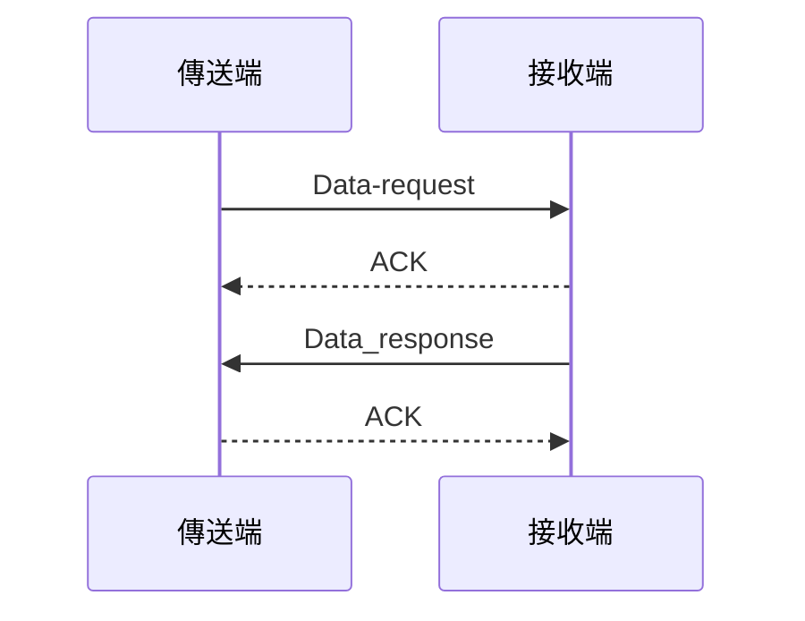
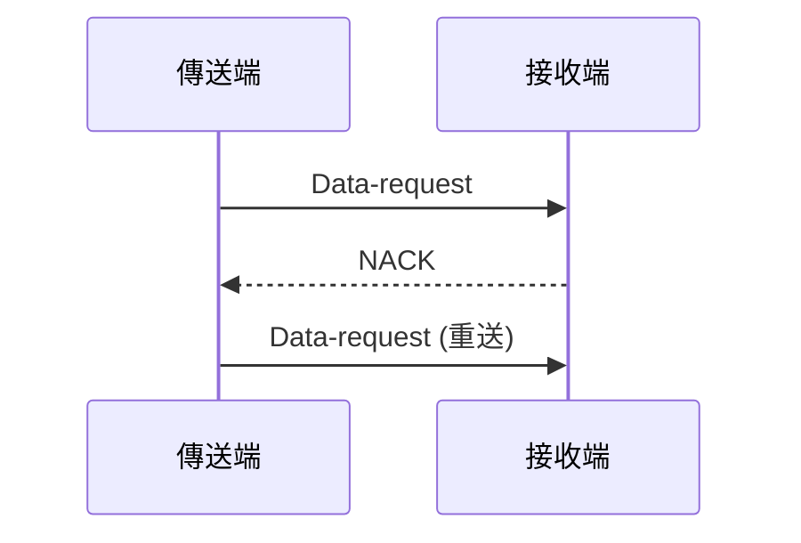
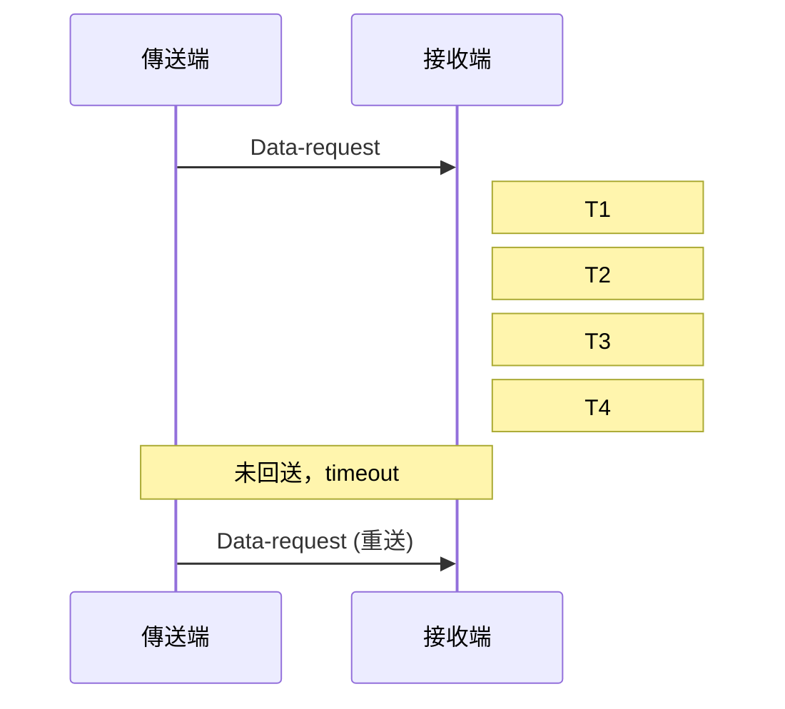

# 都市交通控制通訊協定 3.0 版
交通部  
中華民國九十三年十一月

#### 版本編碼方式
- 採用 M.N 格式
  - M：主要版次（改版幅度較大時使用）
  - N：次要版次（標示小幅調整）
- 修訂期間版本編碼：M.N r a
  - r：標示修訂中
  - a：修訂中通訊協定之序號

### 五、工作範圍與說明

#### 主要通訊協定範圍
1. 通訊底層碼框
2. 號誌控制器(IC)
3. 車輛偵測器(VD)
4. 資訊可變標誌(CMS)

#### 通訊協定等級分類
- B (Basic)：基本交通控制功能
- A (Advance)：進階交通控制功能
- O (Option)：選擇性交通控制功能

### 六、設計理念

主要改進項目：
1. 系統架構設計理念更新
2. 複合碼設計優化
3. 時相步階調整彈性化
4. 觸動控制改進
5. 資訊可變標誌現代化
6. 調撥車道功能擴充
7. 車輛偵測器功能增強
8. 無線通訊支援
9. 時制時段型態彈性化
10. 訊息偵測機制
11. 代傳訊息功能
12. 燈態排列優化

### 七、使用注意說明

#### 通訊協定分類
1. B (Basic)：基本交通控制訊息
2. A (Advance)：進階交通控制訊息
3. O (Option)：選擇性交通控制訊息

#### 設備規格要求
- 號誌控制器：至少需具備基本訊息及進階訊息
- 車輛偵測器：至少需具備基本訊息
- 資訊可變標誌：至少需具備基本訊息

#### 硬體規格注意事項
1. 選擇性交通控制訊息由主辦機關視需要納入
2. 岔路數及綠燈分相數最高限為8
3. 步階設定時相相關代碼
4. 無線通訊環境下的燈號顯示設定
5. 硬體狀態需求明訂

## 肆、現場設備共用訊息

### 訊息分類表

| 序號 | 訊息類別 | 訊息型態 | 訊息編號 | 87年協定 | 訊息等級 | 頁次 | 勾選 |
|------|----------|----------|----------------------|------------------------|----------|------|------|
| 1 | 訊息回應處理 | 設定回報 | 0F H+80 H | 00 H | B | P4-4 | ☆ |
| 2 |  | 設定回報 查詢回報 | 0F H+81 H | 01 H(更新) | B | P4-5 | ☆ |
| 3 | 訊息代傳 | 設定回報 查詢回報 | 0F H+8F H | | A | P4-7 | ☆ |
| 4 | | 設定、查詢 | 0F H+8E H | | A | P4-10 | ☆ |
| 5 | 重新啟動設備 | 設定 | 0F H+10 H | 10 H | B | P4-13 | ☆ |
| 6 |  | 設定回報 | 0F H+90 H | 15 H | B | P4-15 | ☆ |
| 7 | 設備編號管理 | 查詢 | 0F H+40 H | 18 H | O | P4-16 | O |
| 8 |  | 查詢回報 | 0F H+C0 H | 29 H | O | P4-17 | O |
| 9 | 電源中斷回報 | 主動回報 | 0F H+00 H | 1E H | A | P4-18 | ☆ |
| 10 | 設定 | 設定 | 0F H+11 H | 11 H | B | P4-19 | ☆ |
| 11 | 設備通訊重新啟動與檢測管理 | 設定回報 | 0F H+91 H | 19 H | B | P4-20 | ☆ |
| 12 | 設備通訊重新啟動與檢測管理 | 查詢 | 0F H+41 H | 1C H(更新) | B | P4-21 | ☆ |
| 13 | 設備通訊重新啟動與檢測管理 | 查詢回報 | 0F H+C1 H | 1D H | B | P4-22 | ☆ |
| 14 | 設備日期、時間管理 | 設定 | 0F H+12 H | 12 H | B | P4-23 | ☆ |
| 15 | 設備日期、時間管理 | 設定回報 | 0F H+92 H | 13 H(更新) | B | P4-25 | ☆ |
| 16 | 設備日期、時間管理 | 查詢 | 0F H+42 H | 2B H | O | P4-26 | O |
| 17 | 設備日期、時間管理 | 查詢回報 | 0F H+C2 H | 14 H | O | P4-27 | O |
| 18 | 設備日期、時間管理 | 主動回報 | 0F H+02 H | | B | P4-28 | ☆ |
| 19 | 設定 | 設定 | 0F H+13 H | | B | P4-29 | ☆ |
| 20 | 設備韌體燒錄日期及版本管理 | 查詢 | 0F H+43 H | 24 H | B | P4-30 | ☆ |
| 21 | 設備韌體燒錄日期及版本管理 | 查詢回報 | 0F H+C3 H | 25 H | B | P4-31 | ☆ |
| 22 | 設備硬體狀態管理 | 設定 | 0F H+14 H | 16 H(更新) | B | P4-33 | ☆ |
| 23 | 設備硬體狀態管理 | 查詢 | 0F H+44 H | 17 H(更新) | B | P4-34 | ☆ |
| 24 | 設備硬體狀態管理 | 查詢回報 | 0F H+C4 H | 2F H(更新) | B | P4-35 | ☆ |
| 25 | 設備硬體狀態管理 | 主動回報 | 0F H+04 H | 1D H | B | P4-36 | ☆ |
| 26 | 設備資料庫操作鎖定密碼管理 | 設定 | 0F H+15 H | 1F H(更新) | B | P4-39 | ☆ |
| 27 | 設備資料庫操作鎖定密碼管理 | 查詢 | 0F H+45 H | | B | P4-40 | ☆ |
| 28 | 設備資料庫操作鎖定密碼管理 | 查詢回報 | 0F H+C5 H | | B | P4-41 | ☆ |
| 29 | 設備資料庫操作保護管理 | 設定/解除 | 0F H+16 H | 21 H | O | P4-42 | O |
| 30 | 設備資料庫操作保護管理 | 查詢 | 0F H+46 H | | O | P4-43 | O |
| 31 | 設備資料庫操作保護管理 | 查詢回報 | 0F H+C6 H | | O | P4-44 | O |
| 32 | 通訊協定回測狀態 | 查詢 | 0F H+47 H | | O | P4-45 | O |
| 33 | 通訊協定回測狀態 | 查詢回報 | 0F H+C7 H | | O | P4-46 | O | 

## 柒、資訊可變標誌訊息

### 訊息分類表

| 序號 | 訊息類別 | 訊息型態 | 訊息編號 | 87年協定 | 訊息等級 | 頁次 | 勾選 |
|------|----------|----------|----------------------|------------------------|----------|------|------|
| 1 | 循環顯示參數管理 | 設定 | AF H+10 H | | B | P7-4 | ☆ |
| 2 | 循環顯示參數管理 | 查詢 | AF H+40 H | | B | P7-5 | ☆ |
| 3 | 循環顯示參數管理 | 查詢回報 | AF H+C0 H | | B | P7-6 | ☆ |
| 4 | 預設全文管理 | 設定 | AF H+11 H | 74 H | B | P7-7 | ☆ |
| 5 | 預設全文管理 | 查詢 | AF H+41 H | | B | P7-8 | ☆ |
| 6 | 預設全文管理 | 查詢回報 | AF H+C1 H | | B | P7-9 | ☆ |
| 7 | 預設全文彩色參數管理 | 設定 | AF H+12 H | 85 H | B | P7-10 | ☆ |
| 8 | 預設全文彩色參數管理 | 查詢 | AF H+42 H | 79 H | B | P7-12 | ☆ |
| 9 | 預設全文彩色參數管理 | 查詢回報 | AF H+C2 H | 86 H | B | P7-13 | ☆ |
| 10 | 目前全文顯示管理 | 設定 | AF H+13 H | 78 H | B | P7-14 | ☆ |
| 11 | 目前全文顯示管理 | 查詢 | AF H+43 H | 7C H | B | P7-15 | ☆ |
| 12 | 目前全文顯示管理 | 查詢回報 | AF H+C3 H | 7D H | B | P7-16 | ☆ |
| 13 | 目前顯示清除處理 | 設定 | AF H+14 H | 7B H | B | P7-17 | ☆ |
| 14 | 目前全文彩色參數管理 | 查詢 | AF H+44 H | 7A H | B | P7-18 | ☆ |
| 15 | 目前全文彩色參數管理 | 查詢回報 | AF H+C4 H | 87 H(更新) | B | P7-19 | ☆ |
| 16 | 全文顯示頁移動顯示管理(文字跑馬燈) | 設定 | AF H+15 H | 89 H | A | P7-20 | ☆ |
| 17 | 全文顯示頁移動顯示管理(文字跑馬燈) | 查詢 | AF H+45 H | 94 H | A | P7-22 | ☆ |
| 18 | 全文顯示頁移動顯示管理(文字跑馬燈) | 查詢回報 | AF H+C5 H | 95 H | A | P7-23 | ☆ |
| 19 | 中文字型管理(使用者自造字型) | 設定 | AF H+16 H | 70 H | B | P7-24 | ☆ |
| 20 | 中文字型管理(使用者自造字型) | 查詢 | AF H+46 H | 71 H | A | P7-26 | ☆ |
| 21 | 中文字型管理(使用者自造字型) | 查詢回報 | AF H+C6 H | 72 H | A | P7-27 | ☆ |
| 22 | 中文字型管理(使用者自造字型) | (設定)清除 | AF H+17 H | 73 H | A | P7-28 | ☆ |
| 23 | 顯示模組狀態 | 查詢 | AF H+47 H | | B | P7-29 | ☆ |
| 24 | 顯示模組狀態 | 查詢回報 | AF H+C7 H | | B | P7-30 | ☆ |
| 25 | 彩色字窗圖型管理(單一圖形) | 設定 | AF H+18 H | 8E H | B | P7-31 | ☆ |
| 26 | 彩色字窗圖型管理(單一圖形) | 查詢 | AF H+48 H | 8D H | B | P7-33 | ☆ |
| 27 | 彩色字窗圖型管理(單一圖形) | 查詢回報 | AF H+C8 H | A4 H | B | P7-37 | ☆ |
| 28 | 離線顯示模式管理 | 設定 | AF H+31 H | | B | P7-38 | ☆ |
| 29 | 離線顯示模式管理 | 查詢 | AF H+61 H | | B | P7-39 | ☆ |
| 30 | 離線顯示模式管理 | 查詢回報 | AF H+E1 H | | B | P7-40 | ☆ |
| 31 | 設備減光控制管理 | 設定 | AF H+3E H | 27 H | A | P7-41 | ☆ |
| 32 | 設備減光控制管理 | 查詢 | AF H+6E H | 28 H(更新) | A | P7-43 | ☆ |
| 33 | 設備減光控制管理 | 查詢回報 | AF H+EE H | 26 H | A | P7-44 | ☆ |
| 34 | 設備減光控制管理 | 主動回報 | AF H+0E H | 0E H | O | P7-45 | O |

## 貳、通訊底層

### 一、底層通訊協定

本協定之傳輸介面採非同步傳輸方式，以字元為資料識別單元，並配合起始位元和終止位元以作為傳送、接收兩端傳輸資料位元流之準則，資料之基本格式如下所示：

- 起始位元：1 位元（訊號值為 0）。
- 資料長度：8 位元。
- 同位位元：NONE。
- 終止位元：1 位元。
- 模式：中心端為 Answer 模式，現場設備端為 Original 模式。
- 傳輸速率：中央控制設備與終端設備之間通訊速率，如 1200/2400/4800/9600/… bps 等。

#### 對於中心與設備間位元組位元認知之標準

1 位元組 (Byte)：

```
<Bit>
7 6 5 4 3 2 1 0
```

2 位元組以上(含)：

```
<Bit>
15 ... 9 8 7 ... 4 3 2 1 0
```

#### 對於中心與設備間具2個位元組以上(含)之參數變數傳輸順序之標準

```
<Bit>
15 ... 9 8 7 ... 4 3 2 1 0
|  邏輯高位元組  |   邏輯低位元組  |
```

以邏輯高位元組先送，再送邏輯低位元組。

### 二、通訊程序

#### 1. 通訊正常

傳輸採用 Stop and Wait 通訊方式，傳輸時分成傳送端與接收端，
傳輸正常程序如下圖(a)所示，傳送端發出 Data_request 訊息，要求接收端回傳資訊，
接收端於正確收到資料後（CRC 正確）回覆 ACK 與傳送端，如有資訊回傳則接收端傳送 Data_response 訊息給傳送端，
如傳送端正確收到資料後（CRC 正確）回覆 ACK 與傳送端，則完成資料傳送過程。



#### 2. 通訊異常

如資料發生傳輸錯誤（CRC 錯誤），如下圖(b)，接收端發出 NACK 訊號，
傳輸端接收此訊號後，重新傳輸訊息封包，如傳送端連續 5 次接收到 NACK 訊號或接收端連續 5 次發送 NACK 訊號，
則判斷為通訊異常，中心端之通訊伺服器應提出通訊異常訊息給控制中心，現場端設備則以通訊斷線方式處理。



#### 3. 通訊故障（系統異常）

如傳送端於資料傳送後無法收到任何訊息（如圖(c)），則於 timeout 時間後再重送資料，
如連續五次無法成功，則判定系統異常或通訊故障。



- timeout 時間 (T) = 傳送資料封包時間(T1) + 接收端處理時間(T2) + 接收端回應時間(T3) + 傳送端處理時間(T4)
- timeout 時間(T) 須根據載硬體處理速度與通訊速度而定。

### 三、通訊底層碼框運作

1. 本協定中，訊息內容若以16進位表示時，是以數字加H（H放在數字後），如15H（15是以16進位表示，若十進位時則值為21），另一種可表示方式為0x15，用0x（0x放在數字前）表示16進位，若單純數字即表示是用十進位，在使用程式或測試中要需注意是使用那種進位制。

2. 原部頒87年版通訊協定並未定義通訊底層之碼框格式，只在Class B上稍加描述。「都市交通控制通訊協定」3.0版在通訊底層之碼框格式參考台北市交通控制通訊協定之碼框格式，並為提高通訊傳輸正確率，在碼框格式上修改為在Information（訊息欄位）前增加2個bytes之LEN（長度欄位）。另再增加序號欄位（Sequence Number，SEQ）放在ADDR之前（以呼應Class B原有碼框格式），辨識ACK或NAK回應歸屬，主要用途為回應每次上或下載訊息之用，作為分辨ACK或NAK是回應哪個訊息。即每次上或下載訊息時序號欄位之值均更換（如遞增或遞減），當另一端回應ACK或NAK時，將原下載或上傳訊息的序號欄位之值取出，將該值放入回應ACK或NAK之訊息的序號欄位中，讓接收ACK或NAK的一端由序號欄位之值可知道該ACK或NAK訊息是回應哪個下載或上傳的訊息（序號欄位之值相同者）。

#### 碼框格式範例

**下載訊息如下：**（下載訊息之序號欄位為 0x12 時）

| DLE | STX | SEQ  | ADDR   | LEN  | INFO | ... | DLE | ETX | CKS  |
|-----|-----|------|--------|------|------|-----|-----|-----|------|
|0xAA |0xBB |0x12  |0x0001  | ...  | ...  | ... |0xAA |0xCC | ...  |

**ACK 回應如下：**（因原下載訊息之序號欄位為 0x12，故 ACK 回應訊息之序號欄位為 0x12 做回覆該下載訊息）

| DLE | ACK | SEQ  | ADDR   | LEN  | CKS  |
|-----|-----|------|--------|------|------|
|0xAA |0xDD |0x12  |0x0001  | ...  | ...  |

**NAK 回應如下：**（因原下載訊息之序號欄位為 0x12，故 NAK 回應訊息之序號欄位為 0x12 做回覆該下載訊息）

| DLE | NAK | SEQ  | ADDR   | LEN  | ERR  | CKS  |
|-----|-----|------|--------|------|------|------|
|0xAA |0xEE |0x12  |0x0001  | ...  | ...  | ...  |

3. 在網路通訊品質不佳時，會導致無謂的等候，造成通訊時間浪費。因此無論何種訊息，都應予先回應ACK或NAK，而此回覆時間建議統一定義為1秒。若後續尚有資料要回傳，則視各家設備及各項訊息而定。

4. 承上所述，無論何種訊息（除ACK、NAK本身之外），無論上傳/下載，無論控制中心或現場設備，均需先回報ACK或NAK，以作通訊層之回應溝通。而應用層之訊息正確/有效/成功與否溝通，則以通訊協定0F H+80 H 或 0F H+81 H 為之。


